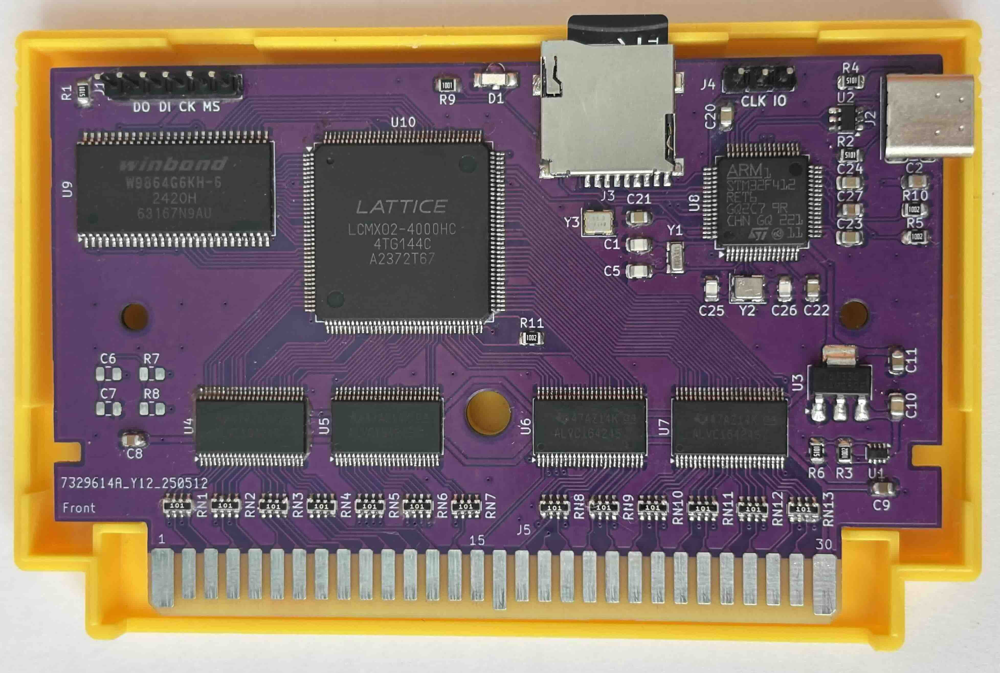

# Open source flash cartridge for FC

**⚠️ This project is currently in active development stage**

## Hardware Features

- **8MB SDRAM** - Single SDRAM module for loading both PRG and CHR data with fast access and execution
- **MachXO2 FPGA** - Main logic implemented in Lattice MachXO2 FPGA
- **ARM processor** - Dedicated ARM processor handles ROM loading from SD card and system management
- **Expansion Audio** - Additional sound support powered by an onboard Op-Amp
- **RTC Battery** - Onboard battery for Real-Time Clock support
- **Simple PCB design** - Circuit design optimized for hand assembly and DIY builds
- **USB programming port** - USB interface for firmware updates

## Software Features

- **Game loading from SD card** - Fast ROM loading and execution directly from SD card storage (supports FAT16, FAT32, and exFAT)
- **In-game menu** - Access save states and return to the main menu without resetting the console
- **Save states** - Save and load game progress at any point during gameplay
- **Battery-backed RAM** - Saving backed RAM to flash storage automatically when entering the in-game menu or resetting the console
- **Alphabetical sorting** - Automatic alphabetical sorting of files and folders in the file browser

## Getting Started

1. **Flash the bootloader**: First, you need to flash the bootloader to the cartridge using the project's [GitHub Pages site](https://hi0t.github.io/fcart/).
2. **Install/Update Firmware**: With the SD card removed, connect the cartridge via USB. It will boot into bootloader mode and appear as a USB drive named `FCART BOOT`. Download the latest `fcart.uf2` firmware file from the [Releases page](https://github.com/hi0t/fcart/releases) and copy it to this drive.
3. **Ready to play**: Insert your SD card with ROMs, plug the cartridge into your console, and it's ready to use!

## Supported Mappers

| | +0 | +1 | +2 | +3 | +4 | +5 | +6 | +7 | +8 | +9 |
|---|:---:|:---:|:---:|:---:|:---:|:---:|:---:|:---:|:---:|:---:|
| **00** | NROM | MMC1B | UxROM | CNROM | | | | AxROM | | |
| **10** | | | | | | | | | | |
| **20** | | | | | VRC6a | | VRC6b | | | |
| **30** | | | | | | | | | | |
| **40** | | | | | | | | | | |
| **50** | | | | | | | | | | |
| **60** | | | | | | | | | | |
| **70** | | | | | | | | | | |
| **80** | | | | | | | | | | |
| **90** | | | | | UN1ROM | | | | | |
| **100** | | | | | | | | | | |
| **110** | | | | | | | | | | |
| **120** | | | | | | | | | | |
| **130** | | | | | | | | | | |
| **140** | | | | | | | | | | |
| **150** | | | | | | MMC1A | | | | |
| **160** | | | | | | | | | | |
| **170** | | KS7058 | | | | | | | | |
| **180** | UNROM | | | | | CNROM | | | | |
| **190** | | | | | | | | | | |
| **200** | | | | | | | | | | |
| **210** | | | | | | | | | | |
| **220** | | | | | | | | | | |
| **230** | | | | | | | | | | |
| **240** | | | | | | | | | | |
| **250** | | | | | | | | | | |

## Planned Features

- [ ] **Extended mapper support** - Adding support for a larger number of mappers to increase game compatibility
- [ ] **FDS support** - Support for loading FDS disk images

## PCB Image

